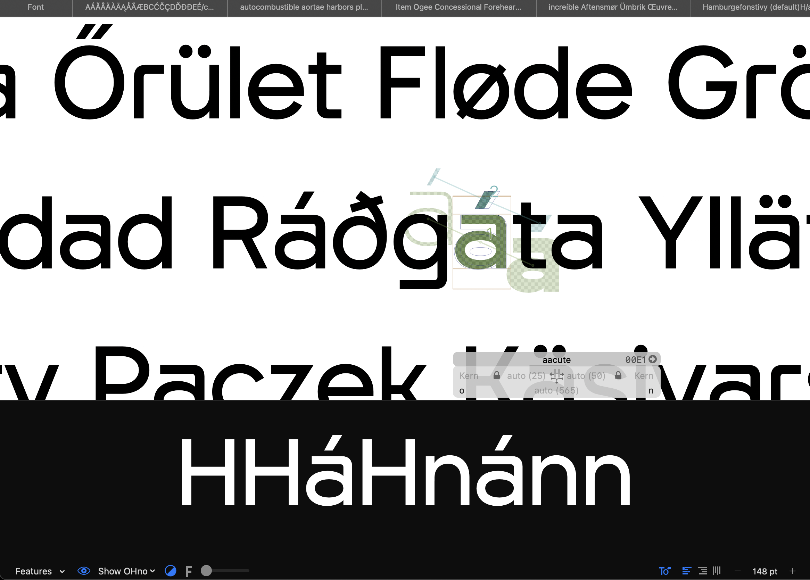

# Show OHno

A plugin for [Glyphs 3 and 4](https://glyphsapp.com). It turns the preview panel under the Edit View into a spacing proof for the glyph you are working on, so you can check it between control letters without typing a test string or switching tabs.

With `x` selected, the preview shows the glyph in a control string such as `HHxHnxnn`, set in the current master. *Show OHno* sits in the preview bar's instance menu next to *Show All Instances*, so switching between the spacing proof and your instances is one click.



## Installation

Download or clone this repository and double-click `ShowOHno.glyphsPlugin`. Glyphs will install it into `~/Library/Application Support/Glyphs 3/Plugins/` (or `Glyphs 4/Plugins/`). Restart Glyphs.

If you used version 1.x, delete `ShowOHno.glyphsReporter` from the Plugins folder first.

If macOS blocks the plugin, run:

```
xattr -cr ~/Library/Application\ Support/Glyphs\ 3/Plugins/ShowOHno.glyphsPlugin
```

For Glyphs 4, use `Glyphs\ 4` in the path.

## Usage

1. Open the preview panel of the Edit View (drag it up from the bottom of the window).
2. Open the instance pop-up menu of the preview bar (the one with *Show All Instances*) and choose **Show OHno** at its end. The preview now shows the selected glyph in the last used proof string.
3. To use another string, pick it in **OHno String** right below. This also switches OHno on.
4. To get back, choose *Show All Instances*, an instance or *-* in the same menu, as usual.

The proof follows the preview bar: its size, black/white, blur slider and flip button (F) apply as usual. Kerning is applied, and a line wider than the panel shrinks to fit. Each tab has its own preview mode.

If stylistic sets or other features are active in the Edit View (Features menu, bottom left), the control glyphs are replaced by their alternates, e.g. `n` → `n.ss01`. This works with the usual suffix naming; the feature code itself is not interpreted.

## Proof strings

`x` stands for the selected glyph.

1. `HHxHnxnn` (default)
2. `nnxooxHHxOO`
3. `nnxnoxoo`
4. `HHxHOxOO`
5. `nnnxnnn`
6. `HHHxHHH`

To change or add strings, edit `TEMPLATE_LINES` at the top of `Contents/Resources/plugin.py`.

## Limitations

- The proof is set in the master of the selected layer, not in instances.

## Requirements

Glyphs 3.0 or later, including Glyphs 4.

## License

MIT, see [LICENSE](LICENSE).
